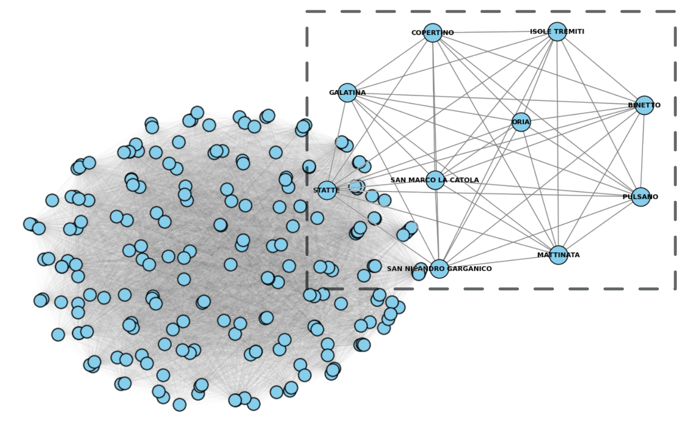

# CAPTURE - Computational Analysis and Predictive Techniques for Urban Resource Efficiency

## Abstract
Municipal waste management (MWM) poses significant challenges in the context of rapid urbanization and population growth. Accurate forecasting of waste production is crucial for designing sustainable waste management strategies. This work proposes a novel methodology leveraging deep learning techniques to forecast municipal waste production. By harnessing the power of deep neural networks and integrating heterogeneous data sources (including demographic and territorial information), we construct a graph representation of municipalities and employ Graph Neural Networks (GNNs) to extract spatial and temporal patterns.

Our methodology has been validated through a case study in the Apulia region (Italy), demonstrating its effectiveness in generating accurate and interpretable forecasts. The framework is adaptable and scalable, providing actionable insights to support data-driven decision-making in urban sustainability.

📄 **Published in:** *Expert Systems*  
🔗 **DOI:** [10.1111/exsy.13768](https://doi.org/10.1111/exsy.13768)

## Citation
If you use this work in your research, please cite:

> Canzaniello, M., Izzo, S., Chiaro, D., Longo, A., & Piccialli, F. (2025). CAPTURE—Computational Analysis and Predictive Techniques for Urban Resource Efficiency. *Expert Systems*, 42(2), e13768. https://doi.org/10.1111/exsy.13768

## Acknowledgments
- PNRR Centro Nazionale HPC, Big Data e Quantum Computing, (CN\_00000013)(CUP: E63C22000980007), under the NRRP MUR program funded by the NextGenerationEU.
